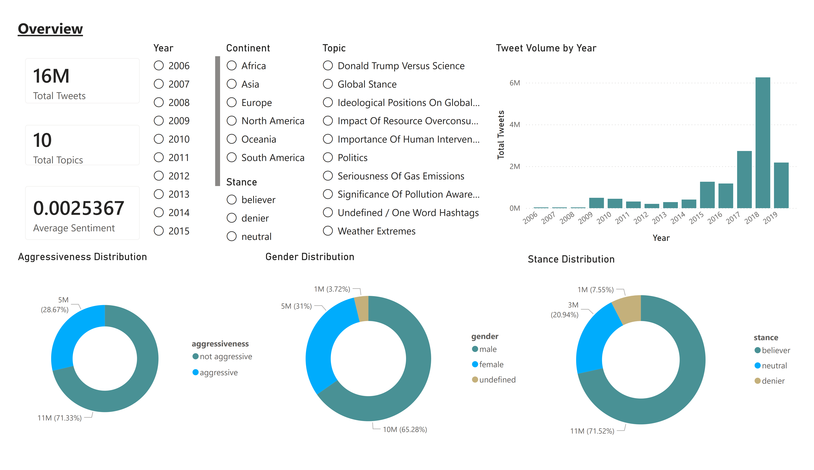
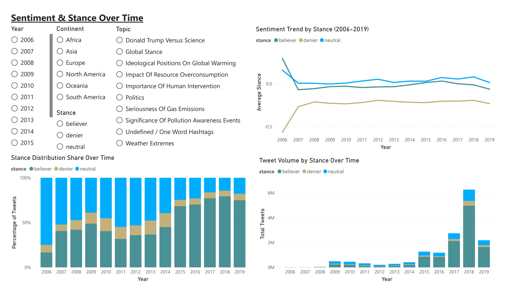
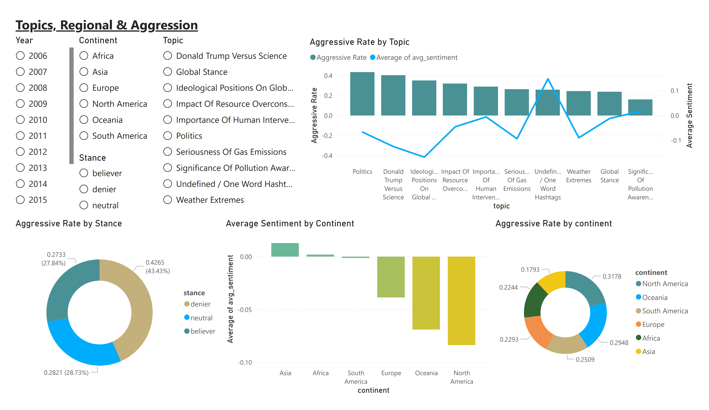

# 🌍 Climate Change Twitter — Sentiment & Stance Analysis

[](https://www.postgresql.org/)
[](https://app.powerbi.com/view?r=eyJrIjoiZjc4NjllNDUtYzJhOS00NTNlLTgwYzItNGE5ZGMwNjkzZmQxIiwidCI6ImMwZmMxNTU3LTEzMzktNDZkZC05MDk1LWExZjM0ZDdiZmI3ZiJ9)
[](https://opensource.org/licenses/MIT)

> End-to-end SQL and Power BI analysis of 15.8 million climate change tweets (2006–2019), investigating how public sentiment, stance, and aggression evolved across 13 years of Twitter discourse.

---

## 📊 Live Dashboard

**[→ View Interactive Power BI Dashboard](https://app.powerbi.com/view?r=eyJrIjoiZjc4NjllNDUtYzJhOS00NTNlLTgwYzItNGE5ZGMwNjkzZmQxIiwidCI6ImMwZmMxNTU3LTEzMzktNDZkZC05MDk1LWExZjM0ZDdiZmI3ZiJ9)**



---

## 🎯 Business Questions

This analysis was structured around two questions:

1. **How have public sentiment and stance on climate change shifted across 13 years of Twitter discourse?**
2. **Which topics and regions are driving the most divisive or aggressive conversations?**

---

## 📁 Dataset

**Source:** [Climate Change Twitter Dataset](https://data.mendeley.com/datasets/mw8yd7z9wc/2)-Effrosynidis, Dimitrios (2022), “The Climate Change Twitter Dataset”, Mendeley Data, V2, doi: 10.17632/mw8yd7z9wc.2

| Attribute | Detail |
|---|---|
| Total Records | 15,817,192 tweets |
| Date Range | June 2006 – October 2019 |
| Dimensions | 7 (timestamp, geolocation, topic, sentiment, stance, gender, aggressiveness) |
| ML Models Used in Source | BERT, LSTM, SVM, VADER |

Each tweet carries a sentiment score (-1 to +1), a stance label (believer / denier / neutral), a topic (LDA-derived), and an aggressiveness classification — all generated by ML models applied by the dataset authors.

---

## 🔬 Methodology

### Data Quality Investigation

Before cleaning, every column was systematically investigated to let the data reveal its issues rather than assume them upfront. Key findings:

| Check | Finding | Decision |
|---|---|---|
| Duplicates | Zero duplicate tweet IDs | No action needed |
| Missing coordinates | 10.48M rows (66%) have no lat/lng | Retained — inherent to Twitter's optional location tagging |
| Sentiment range | Min -0.994, Max 0.991 | Within bounds, no action needed |
| Topic typo | 'Intervantion' misspelled in source | Corrected to 'Intervention' |
| Categorical casing | Mixed case across stance, gender, aggressiveness | Standardised to lowercase |
| Documented date range | Source claims 2008–2022 | Actual data is 2006–2019 — flagged and corrected |

### Continent Assignment

66% of tweets have no geolocation data — a structural limitation of Twitter's optional location tagging. For the 34% with valid coordinates, continent was derived using coordinate boundary ranges in SQL (no Python, no external API). A calibration issue was found and corrected: Central American countries (Costa Rica, Honduras, El Salvador) were falling through the initial North America boundary set at latitude 15. Extending the boundary to latitude 7 resolved this.

**Final geotagged distribution:** North America 64.9% · Europe 19.4% · Oceania 6.2% · Asia 4.9% · Africa 2.6% · South America 1.3%

---

## 🔑 Key Findings

### 1. Deniers Are Significantly More Aggressive Than Believers

| Stance | Tweets | Aggressive Rate | Avg Sentiment |
|---|---|---|---|
| **Denier** | 1,191,386 | **42.65%** | **-0.232** |
| Neutral | 3,305,601 | 28.21% | 0.039 |
| Believer | 11,292,424 | 27.33% | 0.017 |

Deniers are **15 percentage points more aggressive** than believers — a gap that is consistent across every year and every region in the dataset. Denier sentiment is negative in every single year from 2006 to 2019, never crossing zero.

### 2. Politics Is the Most Aggressive Topic

Despite not being the largest topic by volume, **Politics drives a 43.4% aggressive rate** — the highest of all 10 topics. "Significance of Pollution Awareness Events" is the least aggressive at 15.95%, suggesting awareness-driven content attracts calmer discourse than politically charged topics.

### 3. Gender Has No Meaningful Effect on Aggressiveness

Male and female users show nearly identical aggressive rates (27.9% vs 27.8%), despite males accounting for roughly twice the tweet volume. Stance, not gender, is the driver of aggressive behaviour.

### 4. North America Is the Most Aggressive Region

| Region | Aggressive Rate |
|---|---|
| North America | 31.78% |
| South America | ~29% |
| Europe | ~28% |
| Oceania | ~27% |
| Africa | ~25% |
| Asia | 17.93% |

North America's aggression is primarily driven by the Politics and Donald Trump vs. Science topics.

### 5. 2018 Accounted for ~40% of All Tweets

Volume growth accelerates from 2015 onwards, coinciding with the Paris Agreement and increased political polarisation. The 2009 spike to 489,000 tweets aligns with the Copenhagen Climate Summit.

---

## 📈 Dashboard Pages

| Page | Focus |
|---|---|
| **1 — Overview** | High-level KPIs, aggressiveness, gender & stance distribution, tweet volume by year |
| **2 — Sentiment & Stance Over Time** | Sentiment trend by stance (2006–2019), stance share evolution, tweet volume by year |
| **3 — Topics, Regional & Aggression** | Aggressive rate vs. average sentiment by topic, regional aggression, stance aggression breakdown |

All pages include interactive slicers for Year, Continent, Topic, and Stance.




---

## 📁 Repository Structure

```
climate-twitter-sentiment-analysis/
├── dashboard/
│   ├── 01_overview.png
│   ├── 02_sentiment_over_time.png
│   └── 03_topics_aggression.png
├── climate_analysis_tolufashe.sql     # Full PostgreSQL cleaning + analysis queries
├── climate_analysis_report_tolufashe.pdf  # Full written report (4 pages)
├── README.md
└── LICENSE
```

---

## 🚀 Reproducing the SQL Analysis

### Prerequisites
- PostgreSQL 15+
- The source dataset loaded into a table named `climate_tweets`

### Run

```sql
-- 1. Run the full script
\i climate_analysis_tolufashe.sql

-- The script covers:
-- • Data quality investigation
-- • Cleaning and standardisation
-- • Continent derivation from coordinates
-- • Descriptive analytics (volume, stance, sentiment)
-- • Diagnostic analytics (aggressiveness by stance, region, topic)
-- • Predictive analysis setup
```

---

## 📄 Full Report

The complete written report with methodology, findings, and data-backed narrative is available here: [`climate_analysis_report_tolufashe.pdf`](./climate_analysis_report_tolufashe.pdf)

---

## 📧 Contact

John Olaoluwa Tolufashe · [tolufashejohn@gmail.com](mailto:tolufashejohn@gmail.com) · [GitHub](https://github.com/tolufashe)

---

*Built using PostgreSQL and Microsoft Power BI*
